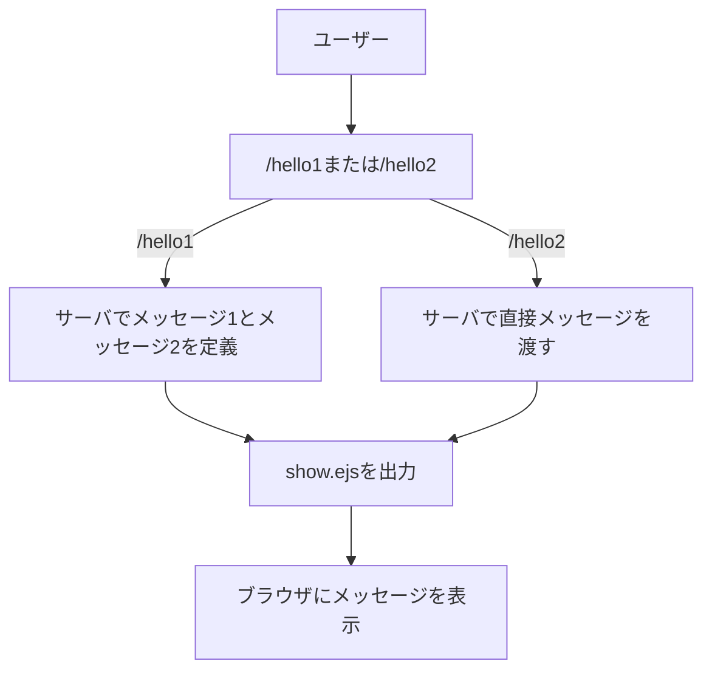
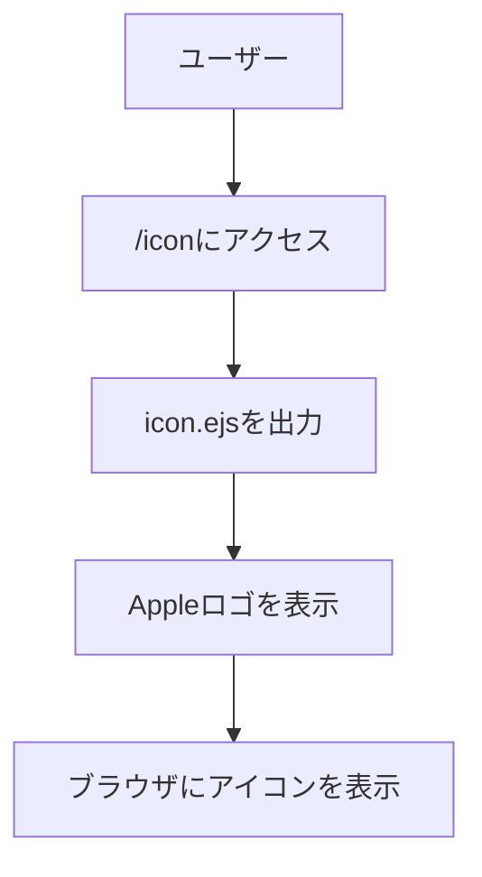
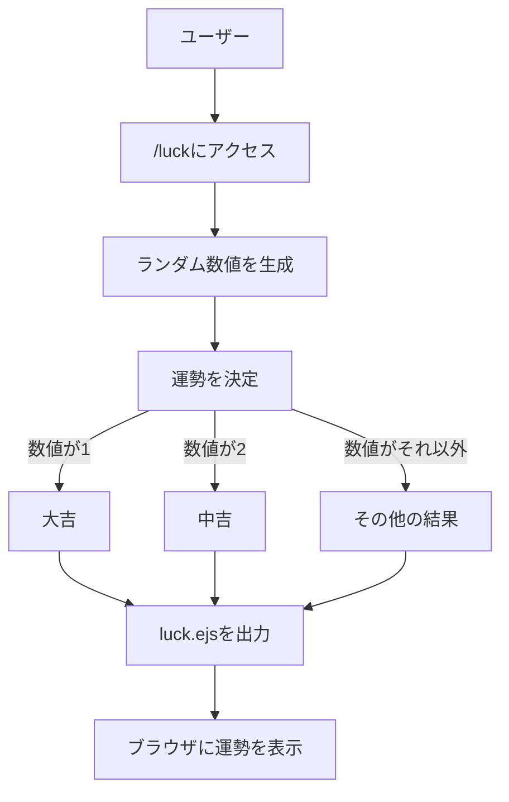
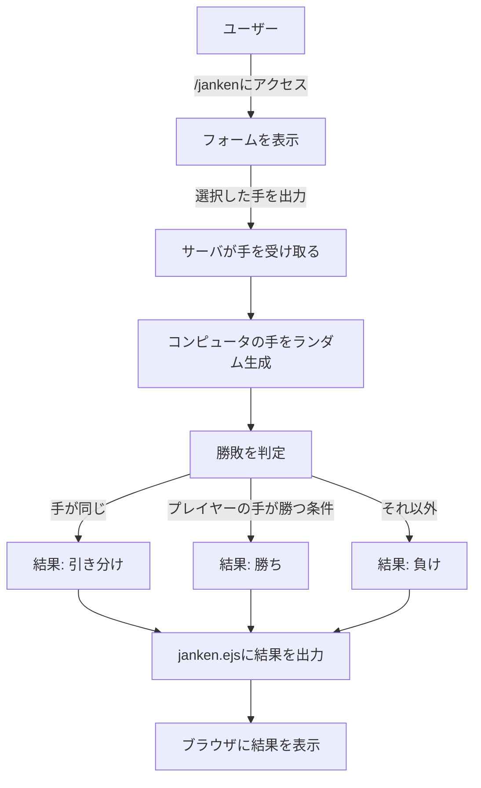
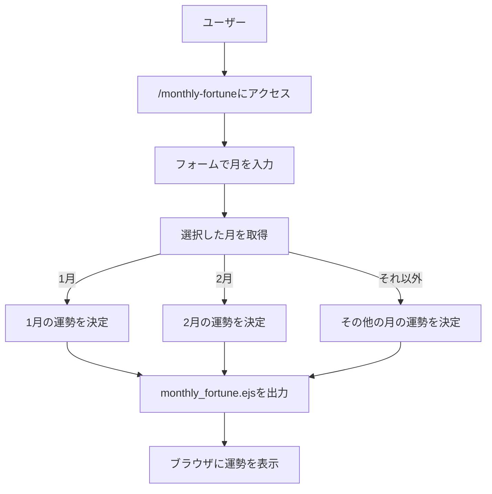
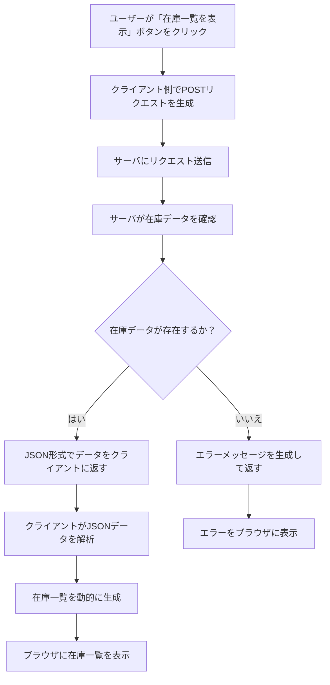
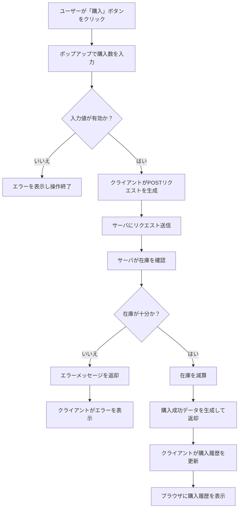
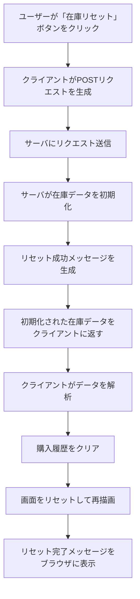

# app5.js ドキュメント

## 概要
`app5.js` は，node.js 環境で動作する簡易的なウェブアプリケーションであり，ユーザーに対してさまざまな機能を提供するものである．このプログラムは，`express` モジュールを利用してサーバーを構築し，`ejs` テンプレートエンジンを用いて動的なHTMLを生成する．以下の機能を含む：
- 挨拶を表示する簡単な機能（/hello1, /hello2）
http://localhost:8080/hello1 http://localhost:8080/hello2
- Appleのロゴを表示する機能（/icon）
http://localhost:8080/icon
- 1-6のランダムな数値で運勢を占う機能（/luck）
http://localhost:8080/luck
- じゃんけんゲーム（/janken）
http://localhost:8080/janken
- 月間運勢占い機能（/monthly-fortune）
http://localhost:8080/monthly-fortune
- ハイアンドローゲーム（/highlow）
http://localhost:8080/highlow

## ファイル一覧

ファイル名 | 説明
-|-
app5.js | プログラム本体
views/icon.ejs | iconのテンプレートエンジン
views/janken.ejs | jankenのテンプレートエンジン
views/luck.ejs | luckのテンプレートエンジン
views/show.ejs | showのテンプレートエンジン
views/monthly_fortune.ejs | 月の運勢占いを表示するテンプレートエンジン
views/highlow.ejs | ハイアンドローゲームの入力画面テンプレートエンジン
views/highlow_result.ejs | ハイアンドローゲームの結果表示テンプレートエンジン
public/Apple_logo_black.svg | Apple ロゴの SVG アイコンファイル

## 起動方法とGitでのファイル管理
### 必要な環境
- node.js
- git
- npm(node.jsに含まれる)

### 起動方法
1. 必要なモジュールをインストールする．以下のコマンドを実行する：`npm install express ejs`
2. 以下のコマンドでアプリケーションを起動する．`node app5.js`
3. 起動に成功すると，コンソールに以下のメッセージが表示される:`Example app listening on port 8080!`
4. ブラウザで `http://localhost:8080` にアクセスする．

### Git による管理
1. ファイルを読み込み，変更の確認をする：`git add .`
2. 変更内容をローカルリポジトリ保存する：`git commit -am 'コメント'`
3. リモートリポジトリに変更を出力する：`git push`

---

## 各機能の説明と使用手順

### app5.js 機能説明

### 1. 「Hello World」の表示
#### 機能説明
ブラウザから `/hello1` または `/hello2` にアクセスすると，EJS テンプレートを利用して「Hello World」と「Bon jour」のメッセージを表示する．

#### 使用手順
以下の URL にアクセスする．
- `http://localhost:8080/hello1`
- `http://localhost:8080/hello2`

ブラウザで上記のURLにアクセスすると，挨拶のメッセージが表示される．
#### フローチャート

### 2. アイコンの表示
#### 機能説明
/icon にアクセスすると，Apple ロゴ（SVG形式）のアイコンが表示される．
#### 使用手順
以下の URL にアクセスする．
- `http://localhost:8080/icon`

ブラウザで上記のURLにアクセスすると，Appleのロゴアイコンを表示する
#### フローチャート

### ３. おみくじ
#### 機能説明
/luckにアクセスすると，ランダムに生成された数値に基づいて，対応する運勢を表示する．

#### 使用手順
以下の URL にアクセスする．
- `http://localhost:8080/luck`

ブラウザで上記のURLにアクセスすると，おみくじの結果が表示される．
#### フローチャート

### ４. じゃんけんゲーム
#### 機能説明
/janken にアクセスすると，表示される画面で「グー」「チョキ」「パー」のいずれかを選択する．「じゃんけん ポン！」ボタンをクリックすると勝敗の結果が表示される．
#### 使用手順
1. 以下の URL にアクセスする．
- `http://localhost:8080/janken`
2. 表示される画面で，グー，チョキ，パーのいずれかのボタンを選択する．
3. 勝敗の結果（勝ち，負け，引き分け）が表示される．
#### フローチャート

### 5. 月の運勢占い
#### 機能説明
/monthly-fortuneにアクセスすると，指定した月の運勢を表示する．

#### 使用手順
1. 以下の URL にアクセスする．
- `http://localhost:8080/monthly-fortune`
2. 表示されるフォームで，1から12の間の月を入力する．
3. “占う”ボタンをクリックすると，その月の運勢が表示される．
#### フローチャート

### 6. ハイアンドローゲーム
#### 機能説明
相手の数字よりも自分のカード(結果に行くまで自分の数字は見れない)が高いか低いかを当てるゲームである．偽チバニー（コンピュータ）が持っているカードに対し，ユーザーが”High”または”Low”を選択する．

#### 使用手順
1. 以下の URL にアクセスする．
- `http://localhost:8080/highlow`
2. 表示される画面で，“High”または”Low”のボタンをクリックする．
3. 結果と偽チバニーからのコメントが表示される．

### 注意事項

・ポート番号はデフォルトで8080を使用している．他のアプリケーションと競合しないよう注意する．
・テンプレートエンジンにはejsを使用している．必要に応じてviewsフォルダ内の.ejsファイルを編集することで，表示内容をカスタマイズできる．
・静的ファイル（CSSや画像など）はpublicディレクトリに配置されている．必要に応じてファイルを追加・編集する．

# エイトNOW ドキュメント

## 概要

`エイトNOW`は，`node.js`環境で動作する在庫管理と購入機能を備えたウェブアプリケーションである．
利用者はブラウザ上で在庫の確認，商品の購入，および在庫リセットが可能である．
本システムは，`node.js` の標準モジュール `http` を用いてサーバを構築している．

## 必要な環境
- node.js
- git
- npm(node.jsに含まれる)
- ブラウザ(Google Chrome推奨)

## ファイル一覧
ファイル名 | 説明
-|-
app99.js | サーバスクリプト
public/box.html | メインのHTMLファイル
public/box.js | クライアントサイドのJavaScriptファイル

## 起動方法
以下の手順でアプリケーションを起動する．
1.	リポジトリをクローンする．
`git clone https://github.com/OzekiSouichirou/webpro_06.git`
`cd webpro_06`
2. 必要なモジュールをインストールする．(本システムはNode.js標準モジュールを使用しているため，特別なモジュールのインストールは不要である．)
3. サーバを起動する.
`node app99.js`
4. ブラウザで以下のURLにアクセスする．
`http://localhost:8080/public/box`

## 使用方法
### 在庫一覧の表示
1.	ブラウザ上で「在庫一覧を表示」ボタンをクリックする．
2.	サーバに在庫データ取得リクエストを送信する．
3.	サーバは在庫データをJSON形式でクライアントに返す．
4.	クライアント側でデータをレンダリングして画面に在庫一覧を表示する．

フローチャート

### 商品の購入
1.	購入したい商品の「購入」ボタンをクリックする．
2.	ポップアップで購入数を入力する．
3.	クライアントが購入データをサーバに送信する．
4.	サーバが在庫データを更新し，購入成功またはエラーメッセージを返す．
5.	購入履歴がクライアント側で更新され，画面に結果が反映される．
フローチャート

### 在庫リセット
1.	「在庫リセット」ボタンをクリックする．
2.	サーバに在庫リセットリクエストを送信する．
3.	サーバが在庫データを初期値にリセットする．
4.	リセット完了メッセージと初期化されたデータをクライアントに返す．
5.	クライアント側で画面を更新し，購入履歴をクリアする

フローチャート

## 注意事項
1.	アプリケーションはデフォルトでポート8080を使用している．ポート競合が発生した場合は他のアプリケーションを停止するか，app99.js内のポート番号を変更すること．
2.	静的ファイル（HTML,JavaScriptなど）はpublicディレクトリに配置されている．必要に応じてファイルを編集または追加する．
3.	本システムはNode.jsの標準機能のみを利用しているため，追加のモジュールインストールは不要である．

